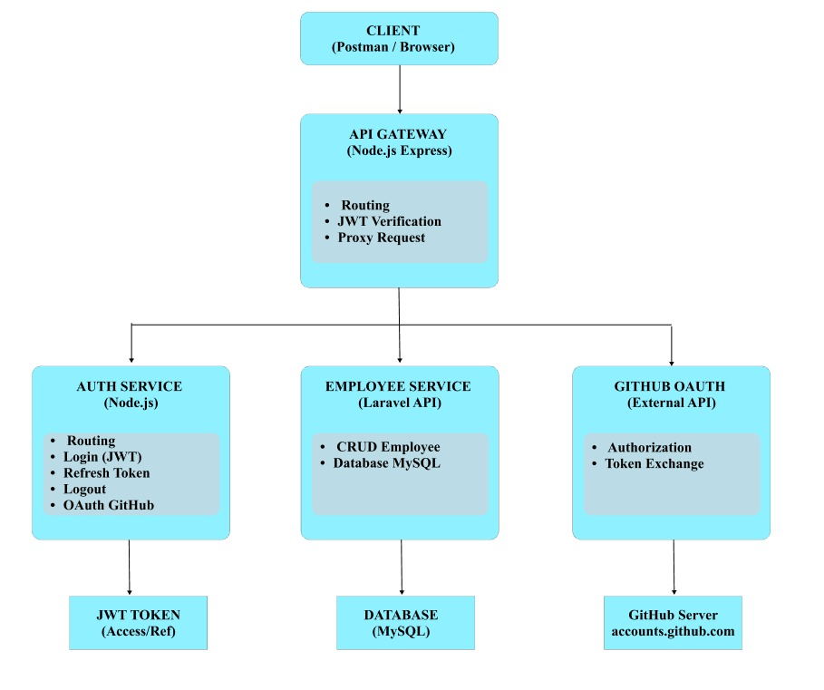

# UTS PPLOS - Sistem Kepegawaian & Absensi

## Identitas
Nama  : Gina Roselia  
NIM   : 2410511027  
Kelas : A_Informatika

## Arsitektur
- API Gateway (Node.js - Express)
- Auth Service (JWT Authentication)
- Employee Service (Laravel API)

## Alur Sistem
Client → API Gateway → Auth Service → Employee Service

## Cara Menjalankan
### 1. Auth Service
cd services/auth-service  
node index.js  

### 2. Employee Service
cd services/employee-service  
php artisan serve  

### 3. API Gateway
cd gateway  
node index.js  

## Authentication
Menggunakan JWT (JSON Web Token)

## Endpoint
### Auth
- POST /auth/login  
- POST /auth/register  

### Employee
- GET /employees  
- POST /employees  
- PUT /employees/{id}  
- DELETE /employees/{id}  

## Testing
Gunakan Postman 
Request Registrasi User (POST /register) melalui API Gateway

Request Login User (POST /login) melalui API Gateway

Request Akses Endpoint Terproteksi (GET /protected) menggunakan JWT melalui API Gateway

Request Registrasi User (POST /register) pada Auth Service

Request Login User (POST /login) pada Auth Service

Request Refresh Token (POST /refresh) pada Auth Service

Request Logout User (POST /logout) pada Auth Service

Request Registrasi User (POST /auth/register) melalui API Gateway

Request Login User (POST /auth/login) melalui API Gateway

Request Penambahan Data Karyawan (POST /api/employees) pada Employee Service

Request Data Karyawan (GET /api/employees) pada Employee Service

Mengecek login di Auth Service lewat API Gateway

Request Data Karyawan (GET /employees) melalui API Gateway

Request Penambahan Data Karyawan (POST /employees) melalui API Gateway

Request Perubahan Data Karyawan (PUT /employees/1) melalui API Gateway

Request Penghapusan Data Karyawan (DELETE /employees/1) melalui API Gateway

## Keterangan
API Gateway digunakan sebagai single entry point untuk mengatur routing dan authentication ke setiap service.

## Diagram Arsitektur

## OAuth (GitHub)
Sistem juga mendukung login menggunakan GitHub OAuth.
Endpoint:
GET /github
User akan diarahkan ke GitHub untuk login, kemudian mendapatkan access token.

## Postman Collection
postman/collection.json
## Demo Video
Link: https://youtu.be/3aGQE5su3Vs?si=gs6VoSyLttImBfcC 